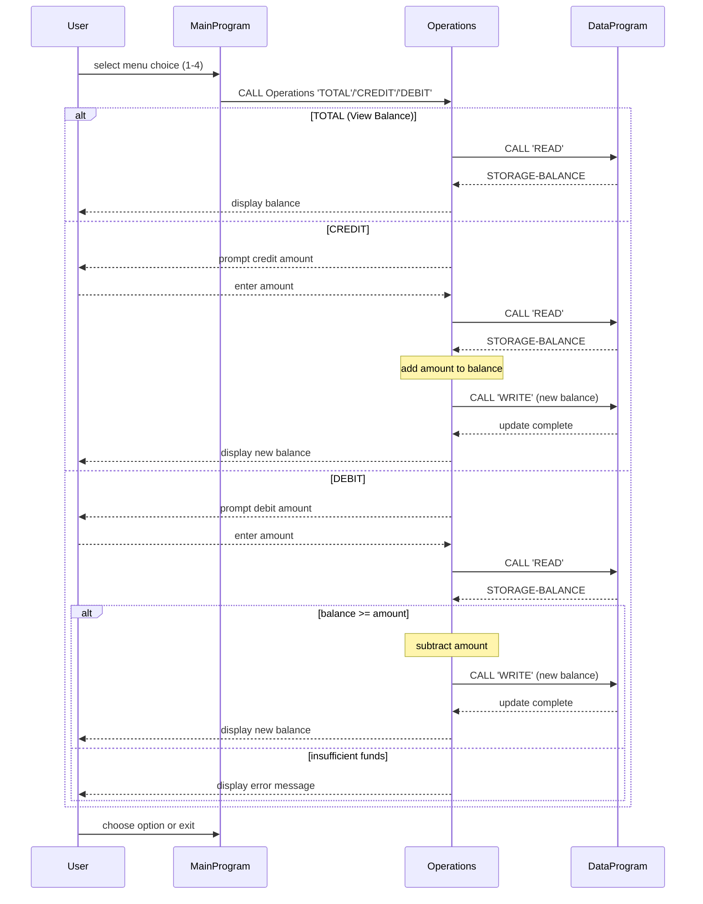

# COBOL Student Account Programs

This directory contains documentation for the COBOL source files used in the student account management system. Each file serves a specific role in handling account data and operations, and adheres to simple business rules around credits, debits, and balance inquiries.

---

## Source File Overview

### `data.cob`

- **Purpose:** Acts as the data storage module for the account balance. It provides a small interface for reading from or writing to a single in-memory balance value.
- **Key Functions:** 
  - `DataProgram` program with a `PROCEDURE DIVISION USING` clause that accepts an operation type (`READ` or `WRITE`) and a balance value.
  - On `READ`, returns the current `STORAGE-BALANCE` to the caller.
  - On `WRITE`, updates `STORAGE-BALANCE` with the provided value.
- **Business rules:** Maintains a single numeric balance (`PIC 9(6)V99`) initialized to `1000.00`. No validation is performed here; callers are responsible for ensuring legitimate values.

### `operations.cob`

- **Purpose:** Implements the business logic for account operations such as viewing the total balance, crediting, and debiting.
- **Key Functions:**
  - `Operations` program reads an operation command passed by the main program.
  - Supports three operation types: `TOTAL `, `CREDIT`, and `DEBIT ` (note the spaces used to pad to six characters).
  - Uses the `DataProgram` to access or update the shared balance data.
  - Prompts the user for amounts when crediting or debiting, and displays the new balance after an update.
- **Business rules:**
  - **View balance (`TOTAL`)** simply reads and displays the current balance.
  - **Credit account:** accepts a positive amount, adds it to balance, updates stored data, and shows the new total.
  - **Debit account:** accepts a positive amount and checks if the current balance is sufficient. If yes, subtracts and updates; if not, displays an "Insufficient funds" message. Negative debits or credits are not explicitly handled (should be positive inputs).

### `main.cob`

- **Purpose:** Provides the user interface and program flow control. Presents a menu to the user and dispatches the selected operations.
- **Key Functions:**
  - `MainProgram` with a loop (`PERFORM UNTIL`) that continues until the user chooses to exit.
  - Displays options to view balance, credit account, debit account, or exit.
  - Captures user choice, validates it, and calls `Operations` with the appropriate command.
  - Sets `CONTINUE-FLAG` to `'NO'` when the user selects exit.
- **Business rules:**
  - Only numeric choices 1-4 are accepted; other inputs prompt an error message and re-display the menu.
  - The program loops until the user explicitly chooses to exit.

---

## Business Rules Summary

1. **Single account balance** is stored in-memory with two decimal places.
2. **Initial balance** is hardcoded at `1000.00` and persists only for the program's lifetime.
3. **Credits** always add the entered amount to the balance.
4. **Debits** require sufficient funds; otherwise, the user is warned and the balance remains unchanged.
5. **User input validation** is minimal; invalid menu entries or non-numeric amounts may not be handled robustly.

---

This documentation provides a quick reference for developers or maintainers working on the COBOL-based student account system. The goal is to modernize or extend these legacy programs while preserving the original business logic.

---

## Sequence Diagram

Below is a Mermaid sequence diagram illustrating the data flow between the three programs in the application:

